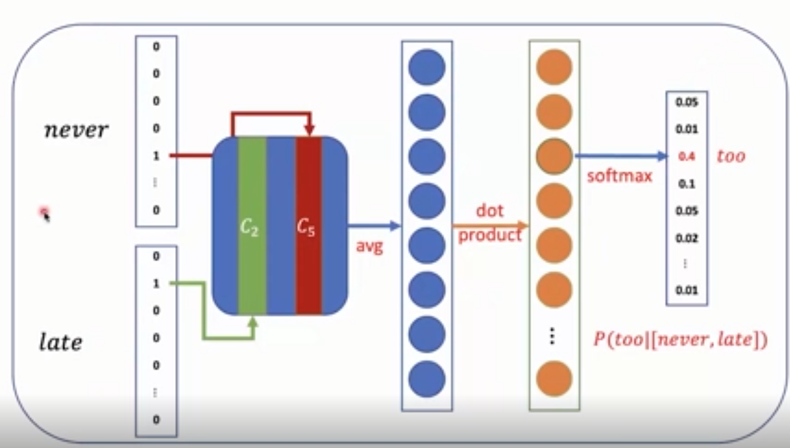
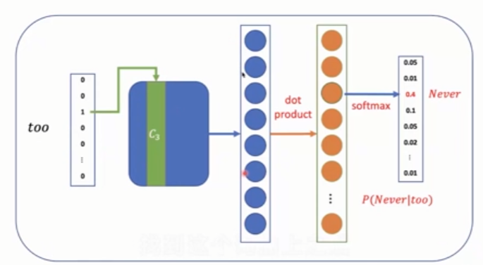
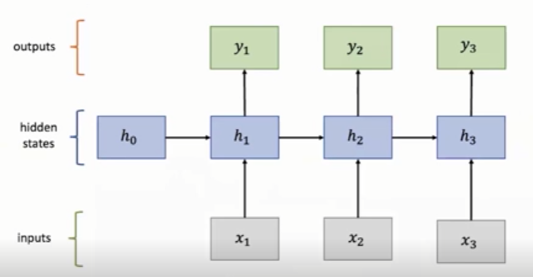
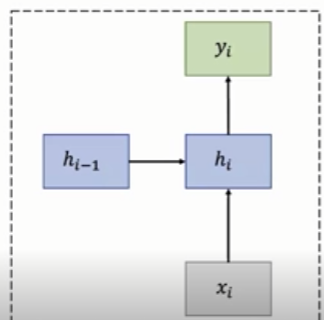
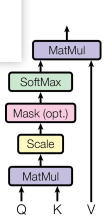
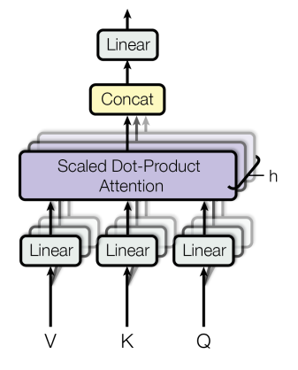
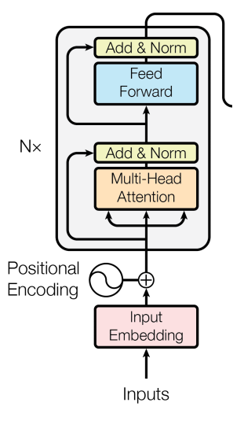
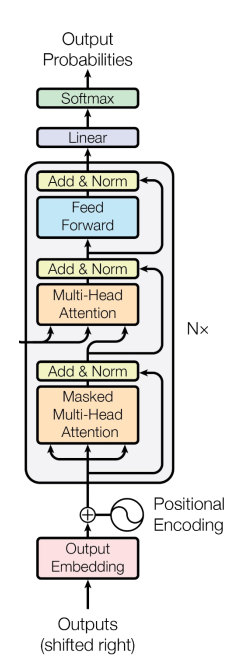

+++
date = '2025-07-07T16:00:00+08:00'
draft = true
title = 'Big_Model_System'
math = true
license = ""
description = ""
categories = [
    "学习笔记"
] 
tags = [
    "大模型"
]
image = ""

+++

## 自然语言处理（NLP）基础

### 基础与应用

自然语言处理是让计算机来理解人类所说的语言，然后像人一样去交互，对话，生成自然语言。

自然语言处理的基础任务：词性标注、命名实体的识别、共指消解（代词与实体之间的连接）、依赖关系（语法等）；中文的自动分词（将中文的每个词区分出来，像英文一样）；机器翻译；情感分类；意见挖掘

### 词表示

词表示：把词转换为机器所能理解的意思

词表示的目标：词相似度的计算；发现词与词之间的语义的关系

word Embedding：**分布式表示**，建立一个低维的一个稠密的向量空间，然后把每一个词都学到这个空间里，用空间里某个位置所对应的向量来表示词。代表方法：word2vec。

### 语言模型

语言模型：根据前文预测下一个词是什么。

#### 语言模型的工作

1. 完成计算一个序列的词成为一句话的概率（joint probability）

$$
P(W)=P(w_1,w_2,\cdots,w_n)
$$

2. 根据前文预测下一个词（Conditional Probability）

$$
P(w_n|w_1,w_2,\cdots,w_{n-1})
$$

#### 语言模型的假设

即将出现的词只受它之前出现词的影响。因此语言模型可表示为：
$$
P(w_1,w_2,\cdots,w_n)=\prod_ip(w_i|w_1,w_2,\cdots,w_{i-1})
$$

#### N-gram Model

模型的搭建：统计前面出现了几个词之后后面出现的那个词的频度是什么样的。

例如4-gram：
$$
p(w_j|too \, late \, to)=\frac{count(too \, late \, to \, w_j)}{count(too \, late \, to)}
$$
其满足Markov assumption：
$$
P(w_1,w_2,\cdots,w_n) \approx \prod_i p(w_i|w_1,w_2,\cdots,w_{i-1})
$$
并且有：
$$
p(w_i|w_1,w_2,\cdots,w_{i-1}) \approx p(w_i|w_{i-k},\cdots,w_{i-1})
$$
问题：不能发现句子间的相似度。类似用独热码来表示词。

#### Neural Language Model

用分布式表示词，将词表示为一个低维向量，在把低维向量拼在一起，形成一个更高维的上下文向量，再进行非线性转换，就可以用其预测下一个词。类似神经网络的过程，其可基于神经网络可调参数来学习上下文间的向量的关系。

## 神经网络

### 神经网络基础

为什么要有激活函数？若不存在激活函数，则多层神经网络都为线性运算，其最终可以被转化为一个单层的神经网络。也就是说，在每一激活函数的情况下，多层神经网络和单层神经网络表达能力是一致的。举例如下：
$$
h_1=W_1 x + b_1,h_2=W_2 h_1 + b_2  \quad -> \quad h_2=W_2 W_1 x + W_2 b_1 + b_2
$$

### Word2vec

word2vec有两类模型：Continuous bag-of-words(CBOW)以及continuous skip-gram。

word2vec用滑动窗口的方式构造训练数据，一个滑动窗口是一个文本中连续出现的几个单词，在窗口中间的词叫做target，其它叫做context。

#### CBOW

CBOW：根据context推测target。其不考虑context词的次序。

下图是CBOW的模型，其是一个多分类问题。类别数为词表大小。

#### continuous skip-gram

continuous skip-gram：根据target推出context。其一次预测多个context时，先将问题进行分解，即一个一个预测context。

下图是continuous skip-gram的模型。

上述模型中，若词表非常大，则训练效率很慢。采用负采样来提高训练效率。

负采样：不把整个词表作为负例，只选几个词表中不是需要predict的词来作为负例来提高计算效率。

#### Sub-Sampling

Sub-Sampling：平衡常见词和罕见词出现的概率

常见词，可能包含的语义比较少，如"的"等，需在训练时去掉，下面是词被去掉的概率
$$
p=1- \sqrt{\frac{t}{f(w)}}
$$
f(w)为一个词出现的频度，t是可自己定义的值。

### 循环神经网络RNN

RNN:Recurrent Neural Network.

其处理序列数据时，会进行顺序记忆。

下面是一个常见的模型结构

#### RNN单元

$$
h_i = tanh(W_x x_i + W_h h_{i-1} + b) \\
y_i =F(h_i)
$$
RNN模型是每一个RNN单元的复制，其参数是一样的，有利于实现参数共享，使得模型能够泛化到不同长度的样本，节省参数量

#### RNN的应用与问题

应用场景：序列标注，序列预测，图片描述，文本分类。

问题：容易产生梯度消失、梯度爆炸。

进行反向传播时，有：
$$
h_i = \tanh(W_x x_i + W_h h_{i-1} + b) \\
\Delta w_1 = \frac{\partial Loss}{\partial w_2} = \frac{\partial Loss}{\partial h_n} \cdot \frac{\partial h_n}{\partial h_{n-1}} \cdot \frac{\partial h_{n-1}}{\partial h_{n-2}} \cdot \; \cdots \; \cdot \frac{\partial h_3}{\partial h_2} \cdot \frac{\partial h_2}{\partial w_2} (反向传播时，链式法则展开)
$$
根据$\frac{\partial h_n}{\partial h_{n-1}}$ 讨论。当 $\frac{\partial h_n}{\partial h_{n-1}} > 1$  ，随着网络层数增多，梯度会像滚雪球一样 **指数级增大** 。极端情况下，梯度过大可能让参数更新变得异常剧烈，模型参数值飙升，训练过程难以稳定，甚至无法收敛，这就是**梯度爆炸**现象。   当 $\frac{\partial h_n}{\partial h_{n-1}} < 1$ ，随着网络层数不断加深，梯度会 **指数级衰减** 。传到前面层（比如靠近输入的层 ）时，梯度会变得极其微小，几乎接近 0 。这会导致这些层的参数更新停滞，模型很难学到深层有意义的特征，训练效果大打折扣，就是**梯度消失问题**。  

RNN单元的变体：GRU、LSTM。核心：计算时，保存周围的记忆，来捕捉远距离的依赖性。

#### 门控循环单元（GRU）

GRU:Gated Recurrent Unit

GRU是RNN的一个变体，其包括更新门以及重置门。

重置门：考虑到上一层的隐藏状态对当前激活，可通过计算获得一个新的临时的激活。当重置门$r_i \approx 0$时，新的激活值和上一状态几乎没有关系。
$$
r_i=\sigma(W_x^{(r)}x_i + W_h^{(r)}h_{i-1} + b^{(r)} )
$$
更新门：权衡目前新得到的激活$h_i$和过去状态$h_{i-1}$的影响。
$$
z_i = \sigma(W_x^{(z)} x_i + W_h^{(z)} h_{i-1} + b^{(z)} )
$$
则新的激活值
$$
\widetilde{h_i}=tanh(W_xx_i + r_i * W_h h_{i-1} + b )
$$
最终隐藏层的状态：
$$
h_i = z_i * h_{i-1} + (1 - z_i)* \widetilde{h_i}
$$

#### 长短期记忆网络（LSTM）

LSTM：Long Short-Term Memory Network

也是RNN的变体，可以学习长期的数据一来关系，关键：**cell**

遗忘门$f_t = \sigma(W \cdot [h_{t-1},x_t] + b_f )$，若$f_t =0$则直接丢弃上一个状态。

输入门，决定有哪些信息可以存入到cell状态中去

输入门$i_t$以及新的待选的cell状态如下：
$$
i_t= \sigma(W_i \cdot [h_{t-1},x_t] + b_i ) \\
\widetilde{C_t} = tanh(W_C \cdot [h_{t-1},x_t] + b_C )
$$
则cell状态：$C_t = f_t * C_{t-1} + i_t * \widetilde{C_t}$

输出门，决定哪些信息可以进行输出
$$
o_t =\sigma(W_o \cdot [h_{t-1},x_t] + b_o ) \\
h_t = o_t * tamh(C_t)
$$

#### 双向RNN

RNN的变体

让当前的predit不仅取决于过去的状态，而且取决于未来的状态

## Transformer

### 注意力机制

解决信息瓶颈。核心思想：在decoder的每一步都把encoder端所有的向量提供给decoder模型。

步骤：

1. 先利用RNN得到一个向量$s_t$
2. 再利用向量$s_1$与encoder所有向量做点积，得到注意力分数$e^t=[s_t^Th_1,\cdots,s_t^Th_N]$
3. 利用softmax将注意力分数变为一个概率分布$\alpha^t=softmax(e^t)$，decoder更关注概率越大的位置的encoder向量。
4. 利用概率分布对encoder向量进行加权平均$o_t=\sum_{i=1}^N \alpha_i^th_i$
5. 拼接$[o_t;s_t]$得到最终用于生成predict的向量

#### 注意力机制的各种变式

1. 若decoder端向量s**维度**与encoder端向量$h_i$不一样，则计算注意力分数时，需添加一个权重矩阵

$$
e_i=s^T W h_i
$$

2. Additive attention：使用一层前馈神经网络

$$
e_i=v^T tanh(W_1 h_i + W_2 s)
$$

#### 注意力机制的特点

* decoder端每次生成的时候，可以关注到encoder端所有信息，解决信息瓶颈问题。

* 缓解RNN中的梯度消失问题。通过在encoder和decoder之间提供一种直接连接的方式，防止梯度在RNN中传播过长，进而导致梯度消失。

* 给神经网络模型，提供了可解释性。

### Transformer机制

#### 模型结构

1. 输入层，将一个文本序列切成一个小的单元token，然后通过embedding可以化为一个向量表示。
   1. transformer采用Byte Pair Encoding的方式来对文本进行切分（BPE方法）
   2. 在每个位置加上一个token的位置向量，叫positional encoding，用来表示它在文本序列中的位置
2. 主要图层部分，主要由encoder或者decoder的Transformer block堆叠而成。
3. 输出层，线性层的变换和softmax，输出一个在词表上的概率分布

#### 输入编码 BPE，PE

BPE过程：首先将语料库中出现的所有单词切分为一个个字母，然后通过统计在语料库中每一个byte gram出现的数量，一个一个把频度最高的Byte gram抽象成一个词加入词表中。

byte gram：连续两个相邻位置字母拼到一起的组合

PE（Positional Encoding）：通过在原有的embedding上加上一个位置向量，让不同位置的单词具有不同的表示，进而让Transformer block可以进行区分。

首先假设经过BPE和embedding之后的向量维度d，则位置编码也是一个维度为的向量，Transformer采用基于三角函数的方法来得到位置向量。具体公式如下：
$$
PE_{(pos,2i)}=sin(pos/1000^{2i/d}) \\
PE_{pos,2i+1}=cos(pos/1000^{2i/d})
$$
其中pos表示当前token在句子中的位置，是从0到这个序列长度的一个数。i为从0到d/2的一个数，表示当前这个位置在embedding中的index。

**Input = BPE + PE**

#### Encoder Block

整体由两大块组成，分别为Muti-Head Attention网络，Feed-Forward Network前馈神经网络（本质上是一个带激活函数的MLP全连接）

两个技巧：

1. 残差连接：将输入和输出直接相加，缓解模型过深后带来的梯度消失问题。

2. 正则化：将输入变为一个均值为0，方差为一的分布，解决梯度消失与梯度爆炸。

##### **注意力机制**

**输入**为**query q**和key-value(k，v)的集合。query和key向量的维度为$d_k$，Value向量的维度为$d_v$。

**输出：**先对value向量做加权平均
$$
A(q,K,V)=\sum_i\frac{e^{q\cdot k_i}}{\sum_j e^{q\cdot k_j}}v_i
$$
当有多个q时，其可以组成矩阵Q，则：
$$
A(Q,K,V)=softmax(QK^T)V
$$
**Scaled Dot-Product Attention:**
若没有Scale，当$d_k$增大时，$q^T k$的方差也随之增大，则softmax后概率分布可能会更尖锐，导致梯度越来越小，使得参数不利于更新。

加入Scale，如下：
$$
A(Q,K,V)=softmax(\frac{QK^T}{\sqrt{d_k}})V
$$
使得注意力分数方差依然为1.

**注意力机制的流程如下：**

##### 多头注意力机制

采用多个结构相同，但参数不同的注意力模块，组成多头注意力机制。

每一个注意力头的计算方式为：
$$
head_i=A(QW_i^Q,KW_i^K,VW_i^V)
$$
当每一个注意力头得到输出后，将输出在维度上进行拼接，然后通过一个线性层进行整合：
$$
MultiHead(Q,K,V)=Concat(head_1,\cdots,head_h)W^O
$$
一个Encodr Block的结构：

#### Decoder Block

一个Decoder Block的结构：

Masked Attention Score：将注意力分数修改为$-\infty$，使得在softmax时，使之变0。用于decoder在文本生成时，不受前面生成文本的影响。

### 优点和缺点

#### 优点

表示能力强，本身适合并行计算，成为预训练语言模型的一个主要框架

#### 缺点

对于参数敏感，优化困难。处理文本复杂度与文本长度$n$为平方关系$O(n^2)$，导致对长度特别长的文本束手无策。

## 预训练语言模型

对语言模型的预训练的一个过程

### PLMs（Pre-trained Lanuage Models）

好处：在语言模型的预训练之后，学习到的知识可以非常容易地去迁移到各种下游任务。

预训练语言模型整体可以分为两种范式：

- Feature-based：作为feature的提取器，在大规模的预料上预训练好模型参数后，把它编码的表示作为一个固定的feature，来交给下游做具体任务的模型，作为下游任务模型的输入。
- Fine-turning（主流）：**通过特定领域数据对预训练模型进行针对性优化，以提升其在特定任务上的性能。**

### Masked LM

BERT为了解决LM是单向的过程，提出Masked LM。 其是Bert预训练中最核心的任务。

基本思想：利用双向信息来预测target token。**掩盖掉$k \%$（15% in Bert）的input word，然后去预测这些被掩盖的word。** 

mask太少，预训练花的时间很长。

mask太多，文章可利用的信息太少。

### few-shot/in-context learning

zero-shot：不给任何数据，只给任务的描述，就能完成任务

few-shot：给一点样例，使之完成任务。

in-context learning：没有针对下游任务做任何参数的更新，只是在上下文中给了这个任务的描述以及样例，通过语言模型自回归地生成去完成任务

Mixture of Experts：把模型参数分成一块一块的模块，每次模型的输入会调用其中的部分子模块来参与计算。每一个子模块相当于experts。

## Transformer 使用

### Pipeline

自动帮忙选择适配任务的模型

### Tokenization

不同的模型有不同的tokenization方式

## Prompt-learning

Promopt-learning给模型额外加一些上下文，去trigger一些想要的token，再用这些token进行后续的处理，进行分类等操作。

1. prompt-learning使用预训练语言模型作为基础的encoders
2. 其加入了一些额外的包含mask的内容，称为template
3. 将标签映射为标签词的过程，称为verbalizer

### Verbalizer

构成：

1. 人经验的选取一个初始词
2. 利用初始词，进行同义词改写扩大词表
3. 利用初始词，用额外的知识库扩大词表
4. 把一个长label分解为多个label

## BMtrain

### 数据并行

把数据分成3份，送至3张显卡上，且每张显卡复制所有的参数。每张显卡对数据进行前向传播和反向传播，得到各自的梯度。将所有梯度进行聚合，利用聚合好的参数调整模型。

#### 分布式数据并行

其没有参数服务器。

每张显卡各自完成参数的更新，让所有显卡参数更新保持一致。

### 模型并行

以线性层为例，把模型分成很多个小的部分，即将参数分成n份，n为显卡的个数，分别发送至每张显卡上，每张显卡上的参数与完整的输入数据进行乘法。最后进行聚合。 由于每张显卡都需要处理完整的输入数据，导致其中间计算结果并没有减少，仍然可能造成显存的溢出。

