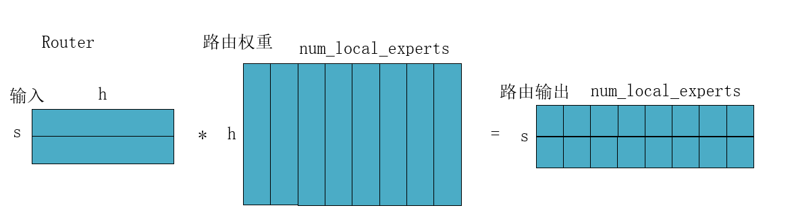
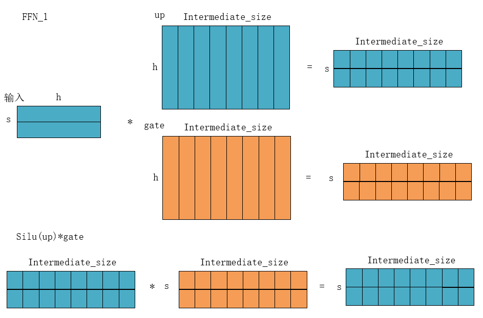
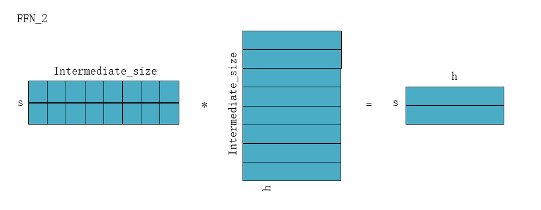
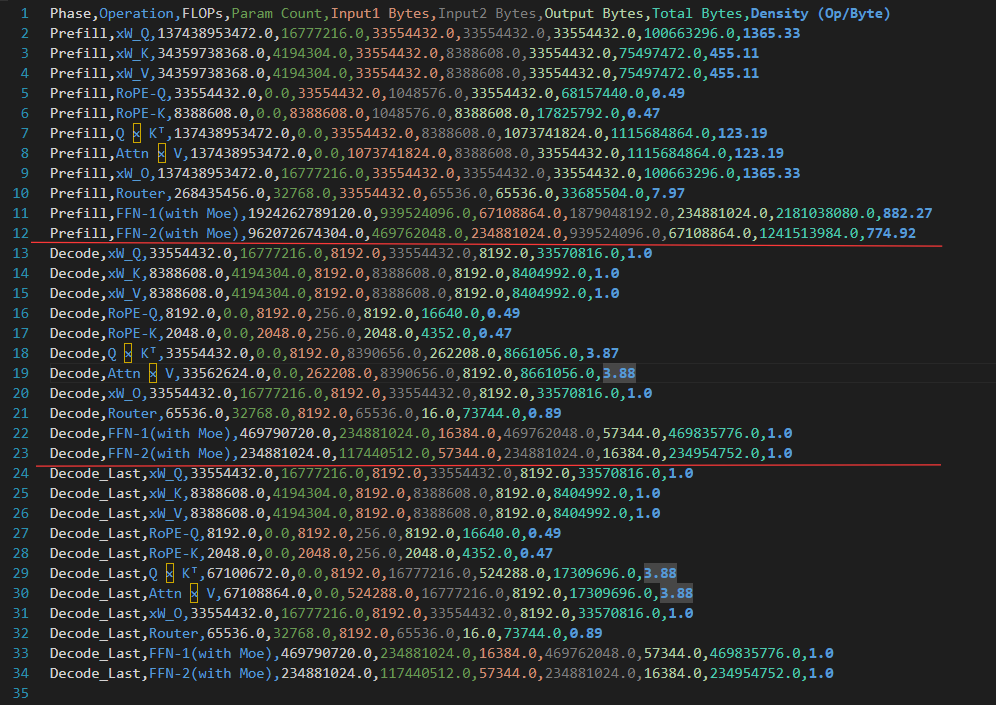
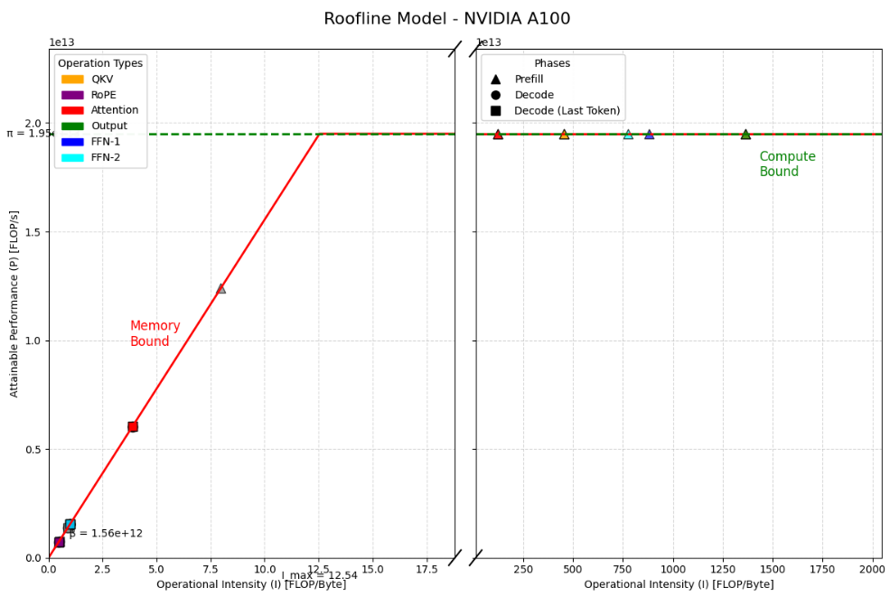
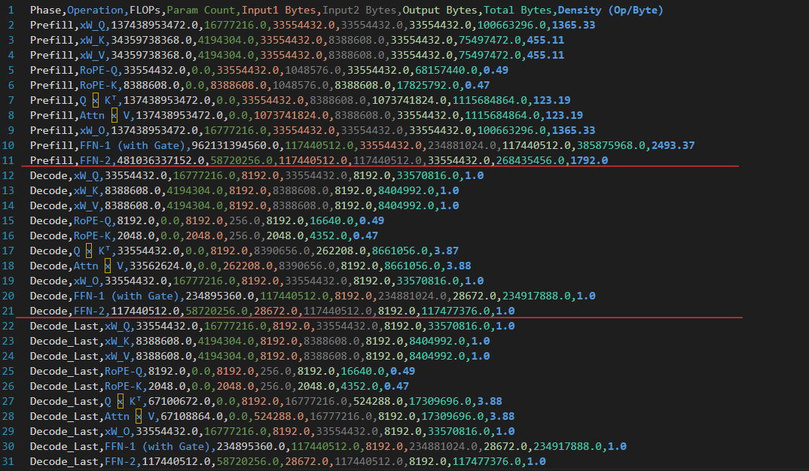
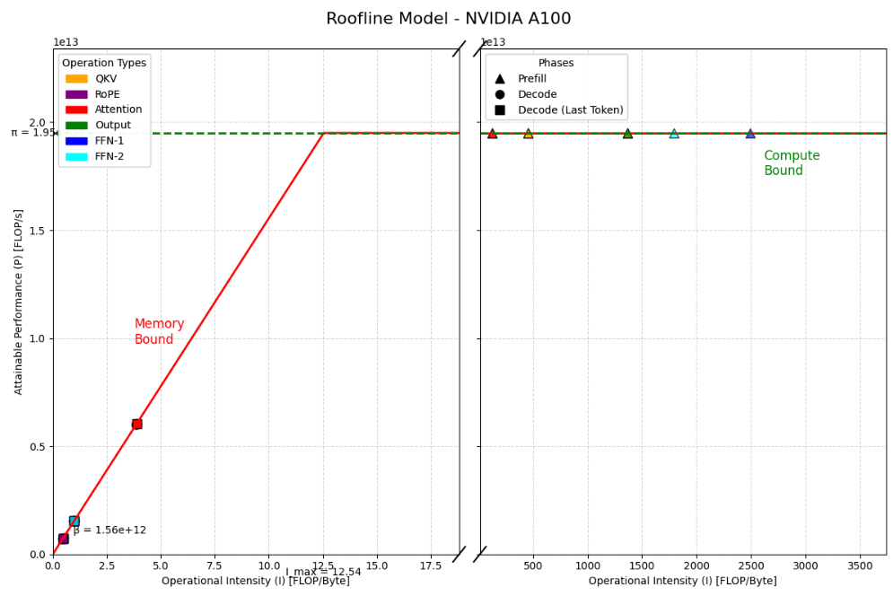

## LLM-para

### 一 、 Moe

#### 1. 启用MoE

```python
use_moe = False
# 如果传入 moe 参数 则启用moe计算
if num_experts_per_tok is not None:
    use_moe = True
```

#### 2. Prefill MoE 参数计算

|    分解    |                    Input1                    |                   Input2                   |                      Output                      |                            运算量                            |
| :--------: | :------------------------------------------: | :----------------------------------------: | :----------------------------------------------: | :----------------------------------------------------------: |
| MoE_Router |                   (b,s,h)                    |           (h,num_local_experts)            |             (b,s,num_local_experts)              |                    2bsh*num_local_experts                    |
|  MoE_FFN1  |        (b, s*num_experts_per_tok , h)        | (num_local_experts,h, intermediate_size*2) | (b,s*num_experts_per_tok ,intermediate_size * 2) | 2bs* num_experts_per_tok * h * intermediate_size * 2 + bs * num_experts_per_tok * intermediate_size |
|  MoE_FFN2  | (b,s*num_experts_per_tok, intermediate_size) | (num_local_experts, intermediate_size, h)  |          (b, s*num_experts_per_tok , h)          |      2bs * num_experts_per_tok * intermediate_size * h       |

#####  路由参数计算



```python
moe_router_flops = b * seq * h * num_local_experts * 2
param_count = h * num_local_experts
add_row(phase, "Router", "(b,s,h)", f"(h,{num_local_experts})", f"(b,s,{num_local_experts})", 
        moe_router_flops, param_count, 
        (b,seq,h), (h,num_local_experts), (b,seq,num_local_experts), a_bit, w_ffn)
```

##### FFN-1计算

**假设prefill输入seq足够大，大到能够使用到所有expert。** 

输入形状为**(b,s*num_experts_per_tok,h)**:  对于每个token，需要送入到num_experts_per_tok个MLP进行计算，则相当于将每个token复制了num_experts_per_tok次，即有seq*num_experts_per_tok个token。

输入权重形状为**(num_local_experts,h,intermediate_size*2)**:  使用到所有expert，且加载up和gate的权重。

所需参数量：num_experts_per_tok个 up+gate 权重矩阵

```python
# FFN-1(up + gate)(with Moe)
FFN_1_moe = b * seq * num_experts_per_tok * h * intermediate_size * 2 * 2  # * 两个矩阵乘法 * 每个token算num_experts_per_tok次
# 额外的逐元素乘法
FFN_1_moe += b * seq * num_experts_per_tok * intermediate_size  # (W₁x) ⊙ SiLU(W_gate*x)

param_count = h * intermediate_size * 2 * num_local_experts  # 两个权重矩阵 * 假设 prefill 用到了所有expert
add_row(phase, "FFN-1(with Moe)", f"(b,{s}*num_experts_per_tok,h)", f"(num_local_experts,h,{intermediate_size}*2)", f"(b,{s}*num_experts_per_tok,{intermediate_size}*2)", 
        FFN_1_moe, param_count, 
        (b, seq * num_experts_per_tok, h), (h, intermediate_size * 2 * num_local_experts), (b, seq * num_experts_per_tok, intermediate_size*2 ), a_bit, w_ffn)
```





##### FFN-2 计算

```python
# FFN-2(with Moe)
FFN_2_moe = b * seq * intermediate_size * h * 2 * num_experts_per_tok
param_count = intermediate_size * h * num_local_experts
add_row(phase, "FFN-2(with Moe)", f"(b, {s}*num_experts_per_tok, {intermediate_size})", f"(num_local_experts, {intermediate_size}, h)", f"(b,{s}*num_experts_per_tok,h)",FFN_2_moe, param_count,
(b, seq * num_experts_per_tok, intermediate_size), (intermediate_size, h, num_local_experts), (b, seq * num_experts_per_tok, h), a_bit, w_ffn)
```



#### 3. Decode MoE参数计算

prefill 阶段的计算每次需要加载**num_local_experts**个MLP的参数。

decode 阶段的计算每次**只**需要加载**num_experts_per_tok**个MLP的参数。

#### 4. 计算结果对比（mixtral-8x7B）

增加Moe功能后，prefill阶段的FFN推理计算密度约为800；同一模型配置，去掉Moe功能，prefill阶段的FFN推理计算密度增加至约为2000。而decode阶段，对于FFN的推理其计算密度都为1。可得，增加Moe功能后，prefill阶段的FFN推理朝着更带宽受限的方向转变。

##### With_Moe仿真结果

```python
num_experts_per_tok = 2
num_local_experts = 8
```





##### Without_Moe仿真结果

```python
num_experts_per_tok = None
num_local_experts = None
```



