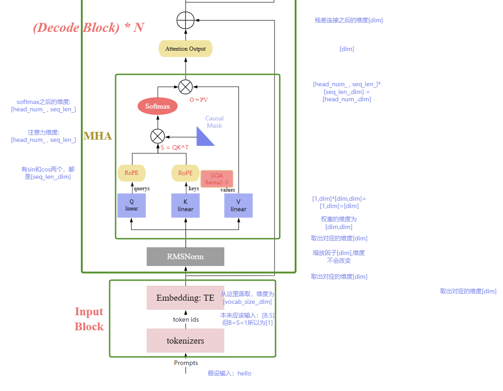

## LLama 源码解读

### class LlamaRMSNorm(nn.Module)

$$
RMSNorm(x) = \frac{x}{\sqrt{\frac{1}{d} \sum}_{i=1}^d x_i^2 + \epsilon } * w
$$

```python
class LlamaRMSNorm(nn.Module):
    def __init__(self, hidden_size, eps=1e-6):
        super().__init__()
        self.weight = nn.Parameter(torch.ones(hidden_size)) # 创建一个 hidden_size 大小的可训练张量
        self.variance_epsilon = eps

    def forward(self, hidden_states):
        input_dtype = hidden_states.dtype
        hidden_states = hidden_states.to(torch.float32)
        # 计算均方 (即 RMS 的平方)
        variance = hidden_states.pow(2).mean(-1, keepdim=True) 
        # 除以 RMS，完成归一化
        hidden_states = hidden_states * torch.rsqrt(variance + self.variance_epsilon)
        return self.weight * hidden_states.to(input_dtype)

    def extra_repr(self):
        return f"{tuple(self.weight.shape)}, eps={self.variance_epsilon}"

```


### llama Mask

#### LLM-Viewer计算密度源码


