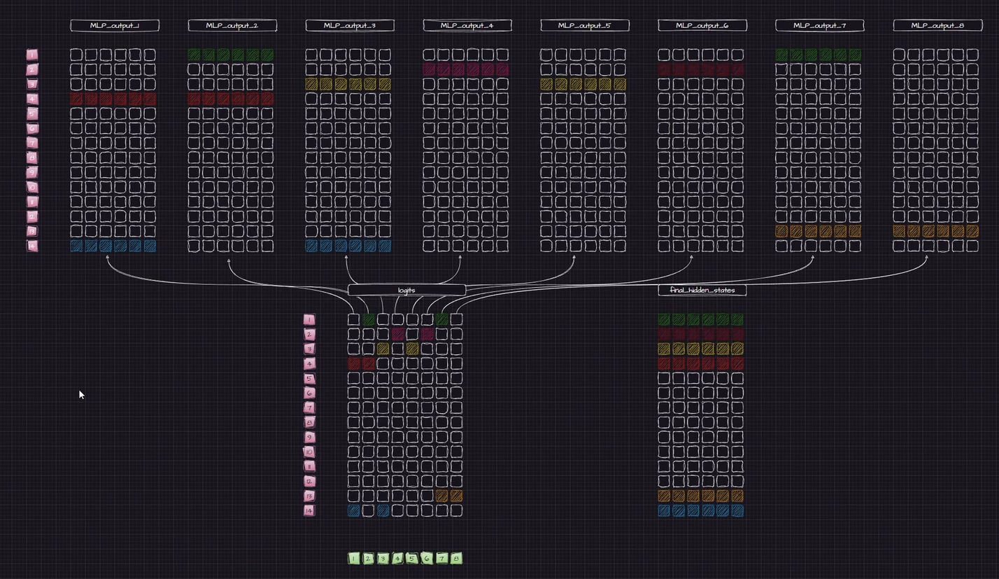
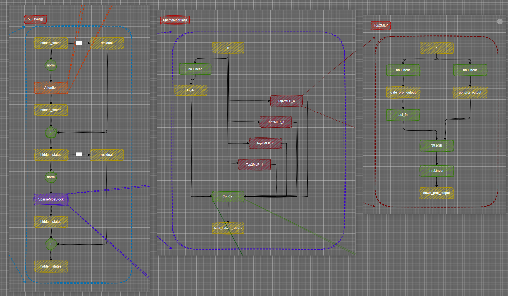

## 源码解读


```python

class MixtralSparseMoeBlock(nn.Module):
    def __init__(self, config):
        super().__init__()
        self.hidden_dim = config.hidden_size # 输入 / 输出特征维度
        self.ffn_dim = config.intermediate_size # 每个专家内部 MLP 的隐藏维度
        self.num_experts = config.num_local_experts # MoE block 的专家数量
        self.top_k = config.num_experts_per_tok # 每个 token 只选择多少个专家（通常 1 或 2）

        '''
        	gating
            作用：路由器（Router），把 token 的 hidden_state 映射到各个专家的 logits	
            输出 shape = [batch_size*seq_len, num_experts]
            后续通过 softmax 得到每个 token 对应每个专家的权重
        '''
        self.gate = nn.Linear(self.hidden_dim, self.num_experts, bias=False)
		
        # 创建num_experts 个MLP
        self.experts = nn.ModuleList([MixtralBlockSparseTop2MLP(config) for _ in range(self.num_experts)])

        # Jitter parameters
        # 对每个 token 的 hidden_state 添加随机扰动 避免路由器输出完全相同的 logits
        self.jitter_noise = config.router_jitter_noise

    def forward(self, hidden_states: torch.Tensor) -> torch.Tensor:
        """ """
        batch_size, sequence_length, hidden_dim = hidden_states.shape
        if self.training and self.jitter_noise > 0:
            hidden_states *= torch.empty_like(hidden_states).uniform_(1.0 - self.jitter_noise, 1.0 + self.jitter_noise)
        # 将 hidden_states 展平 [batch_size, seq_len, hidden_dim] ->  [batch_size*seq_len, hidden_dim]
        hidden_states = hidden_states.view(-1, hidden_dim)
        # router_logits: (batch * sequence_length, n_experts)
        router_logits = self.gate(hidden_states)

        routing_weights = F.softmax(router_logits, dim=1, dtype=torch.float)
        # 获得所选择的专家 以及专家的权重
        routing_weights, selected_experts = torch.topk(routing_weights, self.top_k, dim=-1)
        
        # 对权重进行归一化
        routing_weights /= routing_weights.sum(dim=-1, keepdim=True)
        # we cast back to the input dtype
        routing_weights = routing_weights.to(hidden_states.dtype)

        final_hidden_states = torch.zeros(
            (batch_size * sequence_length, hidden_dim), dtype=hidden_states.dtype, device=hidden_states.device
        )

        # 为每个 token 的 top-k 专家创建掩码（mask）
        # shape = [num_experts, top_k, num_tokens]
        expert_mask = torch.nn.functional.one_hot(selected_experts, num_classes=self.num_experts).permute(2, 1, 0)

        # expert_hit 记录 实际需要计算的专家索引
        expert_hit = torch.greater(expert_mask.sum(dim=(-1, -2)), 0).nonzero()
        for expert_idx in expert_hit:
            expert_layer = self.experts[expert_idx]
            # idx表示 top几  top_x表示 哪个token  计算哪些 token 选择了当前 expert
            idx, top_x = torch.where(expert_mask[expert_idx].squeeze(0))

            # [num_selected_tokens, hidden_dim]  选出token
            current_state = hidden_states[None, top_x].reshape(-1, hidden_dim)
            
            # 专家的输出 乘以权重
            current_hidden_states = expert_layer(current_state) * routing_weights[top_x, idx, None]

            final_hidden_states.index_add_(0, top_x, current_hidden_states.to(hidden_states.dtype))
        final_hidden_states = final_hidden_states.reshape(batch_size, sequence_length, hidden_dim)
        return final_hidden_states, router_logits

```


