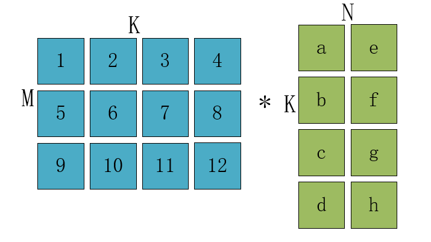

## PE阵列时间和能效分析

### 1. 用小矩阵乘法，确定PE阵列大小以及数据流方式

以下图所示$M*K$和 $K*N$的矩阵乘法为例

对于每一种数据流，都有确定的PE阵列的大小使得，两个矩阵相乘所用时间最小。都为
$$
t_{min}=2S_R+S_C+T-2
$$
每种数据流对应的PE阵列大小如下表所示，$S_R$为阵列行数，$S_C$为阵列列数。$T$为时间维度。

|      | $S_R$ | $S_C$ | $T$  |
| :--: | :---: | :---: | :--: |
|  OS  |   M   |   N   |  K   |
|  WS  |   K   |   N   |  M   |
|  IS  |   K   |   M   |  N   |

### 2. 用已确定的数据流方式，对大矩阵乘法进行分块

沿着矩阵的$S_R$和$S_C$方向对大矩阵进行分块，则在每个方向上分块次数为：
$$
F_R = \lceil S_R/R \rceil \\
F_C = \lceil S_C/C \rceil
$$
则完成大矩阵所需时间为：
$$
\begin{aligned}
T &= t_{min} * \lceil S_R/R \rceil \lceil S_C/C \rceil  \\ 
&= (2R+C+T-2)\lceil S_R/R \rceil \lceil S_C/C \rceil
\end{aligned}
$$
