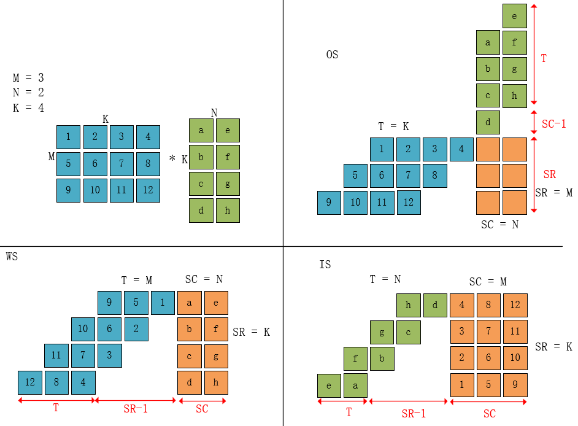
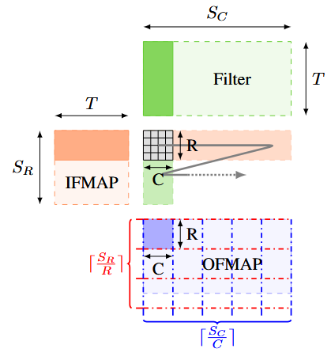
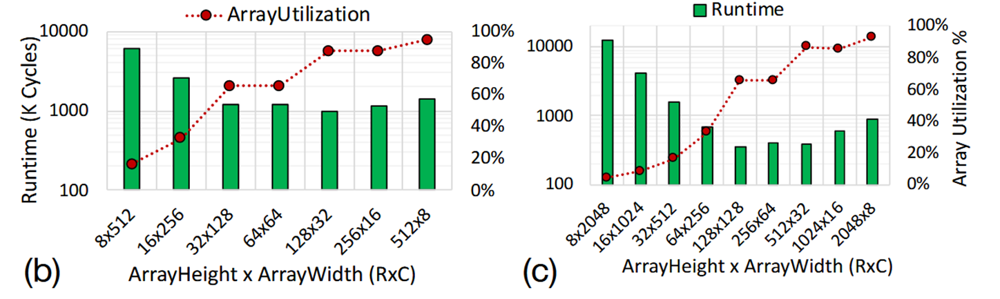

## PE阵列时间和能效分析

参考论文：

A Systematic Methodology for Characterizing  Scalability of DNN Accelerators using SCALE-Sim（20 ISPASS）

### 1. 用小矩阵乘法，确定PE阵列大小以及数据流方式

下图中，蓝色表示$I$，绿色表示$W$，橙色表示PE。

对于左上角的矩阵乘法，有3种数据流方式，假设PE无限多。对于每一种数据流有确定的PE阵列规模使得，两个矩阵相乘所用时间最小。都为
$$
t_{min}=2S_R+S_C+T-2
$$
每种数据流对应的PE阵列大小如下表所示，$S_R$为阵列行数，$S_C$为阵列列数。$T$为时间维度。

|      | $S_R$ | $S_C$ | $T$  |
| :--: | :---: | :---: | :--: |
|  OS  |   M   |   N   |  K   |
|  WS  |   K   |   N   |  M   |
|  IS  |   K   |   M   |  N   |

对于同时有GEMM 和 GEMV的 LLM推理，采用WS的数据流会好一点？？？ 这样会把M维度作为PE阵列的T进行运算，M=1就是GEMV，M>1就是GEMM。

### 2. 用已确定的数据流方式，对大矩阵乘法进行分块

#### 2.1 大矩阵乘法运算时间

对于一个确定的数据流，有一个确定的T。则对大矩阵进行分块时，无需考虑T维度，每一次小矩阵计算时，应将T维度全部计算完成。

则分块时，只需考虑沿着大矩阵的$S_R$和$S_C$两个方向进行分块。

沿着矩阵的$S_R$和$S_C$方向对大矩阵进行分块，则在每个方向上分块次数为：
$$
F_R = \lceil S_R/R \rceil \\
F_C = \lceil S_C/C \rceil
$$
则完成大矩阵运算所需时间为：
$$
\begin{aligned}
T &= t_{min} * \lceil S_R/R \rceil \lceil S_C/C \rceil  \\ 
&= (2R+C+T-2)\lceil S_R/R \rceil \lceil S_C/C \rceil
\end{aligned}
$$

#### 2.2 PE阵列形状对矩阵运算时间的影响

图 (b-c) 展示了分别具有 4096 和 16384 个 MAC 单元的PE阵列在不同比例（行:列）下的配置情况。

1. 第一个观察是：即便在相同的工作负载下，最优配置与其他配置的运行时间差异也可能相差几个数量级，这种差异取决于阵列的规模。随着阵列规模的增大，这种差异会进一步加剧。

2. 在考虑阵列利用率时，出现了一个趋势：对于阵列利用率较低的配置，其层运行时间会较长。当阵列的形状变得高度“矩形化”时，利用率的影响反而不那么显著。在这类配置中，即使实现了很高的利用率，运行时间的改善也很有限。这是因为数据装载和卸载所需的时间开始占主导地位。

### 3. 在多个大矩阵乘法中找最优解

1. 对于每一个大矩阵乘法$w_l=(S_C,S_R,T)$有一个最优的PE阵列规模$a_k=(R,C)$。

2. 则对于每一个$a_k$可以算出每一个大矩阵乘法的运行时间$T(w_l,a_k)$。
3. 找出最小的$a_k$使得$\sum T(w_l,a_k)$最小。即$argmin_{a_k} \sum_{w_l}T(w_l,a_k)$。

