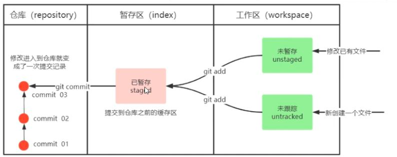

## Git 项目管理

### 一、 使用SSH建立Git 远程仓库和本地库连接

#### 1. **查看当前User和Email配置**

```
git config --list
```

#### 2. 配置当前User和Email配置

```
$ git config --global user.name "Your Name"
$ git config --global user.email "email@example.com"
```

邮箱和github绑定的邮箱一样；

#### 3. 创建SSH Key

创建SSH Key。在用户主目录下，看看有没有.ssh目录，如果有，再看看这个目录下有没有id_rsa和id_rsa.pub这两个文件，如果已经有了，可直接跳到下一步。如果没有，在这里打开Git Bash，创建SSH Key：

```
$ ssh-keygen -t rsa -C "email@example.com"
```

一路回车，结束后在用户主目录里找到.ssh目录，里面有id_rsa和id_rsa.pub两个文件。**复制id_rsa.pub内容。**

**登陆GitHub，打开“settings”，“SSH and GPG Keys”页面，点击‘New SSH key’，然后填上任意Title，在Key文本框里粘贴id_rsa.pub文件的内容**


#### 4. 验证是否成功

为了验证是否成功，输入以下命令：

```
$ ssh -T git@github.com
The authenticity of host 'github.com (52.74.223.119)' can't be established.
RSA key fingerprint is SHA256:nThbg6kXUpJWGl7E1IGOCspRomTxdCARLviKw6E5SY8.
Are you sure you want to continue connecting (yes/no/[fingerprint])? yes                   # 输入 yes
Warning: Permanently added 'github.com,52.74.223.119' (RSA) to the list of known hosts.
Hi ! You've successfully authenticated, but GitHub does not provide shell access. # 成功信息
```

以下命令说明我们已成功连上 Github。


## 二、 远程库操作

### 1. 创建远程库及本地仓库

- github创建仓库，获取 **ssh 链接**

- 在本地项目文件夹下

  ```
  $ git init                                  # 初始化
  $ git add 文件                         # 添加文件
  $ git commit -m "每一版本的备注信息"        # 提交并备注信息
  
  # 提交到 Github
  $ git remote add origin github的ssh链接地址  # 把远程仓库添加到本地仓库，并取名为 origin
  
  # 把本地的 master 分支推送到远程的 origin 仓库
  # -u (--set-upstream) 表示把本地 master 和远程 master 绑定起来
  # 以后就可以直接用 `git push` 或 `git pull`，不用每次写上远程名和分支名
  $ git push -u origin master
  ```


### 2. 推送到远程仓库

推送 **本地某分支 至 远端某分支** 命令:

**`git push [-f] [-u] [远端名称] [本地分支名][:远端分支名(若和本地分支名相同，可省略)]`**

- -f 强制覆盖远端内容，一般不用

- **-u (--set-upstream) 表示把本地分支和远端分支绑定起来**

  - **若两分支已绑定，则可直接`git push`**

    例： `git push -u origin master:master`， 将本地master分支与远端仓库origin的master分支绑定

绑定后推送内容，**实例如下**：

```
$ git add 修改/添加的文件
$ git commit -m "版本信息(作出的修改)"
$ git push     # 推送到 Github
```

- `git branch -vv` 显示 **每个本地分支对应的远程跟踪分支**（如果有的话）

### 3. 提取远程仓库

Git 有两种操作用来提取远程仓库的更新。

- 1、将远程仓库的更新都抓取到本地：

​	**`git fetch`**

​	该命令执行完后需要执行 **`git merge`**  合并远程更新到你所在的分支。

- 2、`git pull` = `git fetch` + `git merge` 的快捷方式。

**每次推送本地内容至远程仓库时，应先提取远程仓库，并解决冲突，然后`git push`**

### 4. 查看当前本地项目链接了什么远程仓库

```
$ git remote -v
```

#### 添加远程仓库

```
git remote add [别名] [url]
```

#### 删除远程仓库：

```
git remote rm [别名]
```


## 三、 git 基础命令



### 1. 查看暂存区、工作区修改文件的状态

**`git status`**

### 2. 将工作区文件添加到暂存区

**`git add 文件名/通配符`**

文件名/通配符： linux文件目录

#### 一般做法

- 使用 **`git add .`** 命令将所有文件加入暂存区

- 如下编写 **`.gitignore`** 文件，使得  **git add .** 忽略某些文件。

  ```
  # 忽略所有文件夹下 .a 文件
  *.a
  # 但是不想忽略 lib.a 文件
  !lib.a
  # 忽略某个特定的文件，/ 表示仓库根目录
  /TODO
  # 忽略 build 文件夹下所有文件
  build/
  # 忽略 doc/notes.txt,但不忽略 doc/server/arch.txt
  doc/*.txt
  # 忽略所有 doc/directory下的 .pdf 文件
  doc/**/*.pdf
  ```

### 3. 提交暂存区到本地仓库

`git commit -m'注释内容'`

### 4. 查看提交日志

**`git log`** ， 可看到每次提交的**commitID**，及修改备注

为方便使用，在linux的 **.bashrc** 文件下添加。后续用`git-log`代替。

```
alias git-log='git log --pretty=oneline --all --graph --abbrev-commit'
```

### 5. 版本回退

**`git reset --hard commitID`** 回到过去第commitID 的版本

回退版本后，想要返回回退前，可用 **`git reflog`** 查看回退前的commitID。


## 四、 git分支管理

### 1. 查看分支

**`git branch`**

### 2. 创建分支

**`git branch a(分支名)`**

### 3. 切换分支

**`git checkout a(分支名)` 切换到a分支**

- 创建并切换到一个分支 `git checkout -b 分支名`

### 4. 合并分支

**`git merge a(分支名)`**

### 5. 删除分支

不能删除当前分支，只能删除其它分支

**`git branch -d 分支名` 删除分支时，需要做各种检查**

`git branch -D 分支名` 强制删除

### 6. 解决冲突

当两个分支上对文件的修改可能会存在冲突，例如同时修改了同一个文件的同一行，这时就需要手动解决冲突，解
决冲突步骤如下：

- 1. 处理文件中冲突的地方
- 2. 将解决完冲突的文件加入暂存区（add)
- 3. 提交到仓库(commit)
